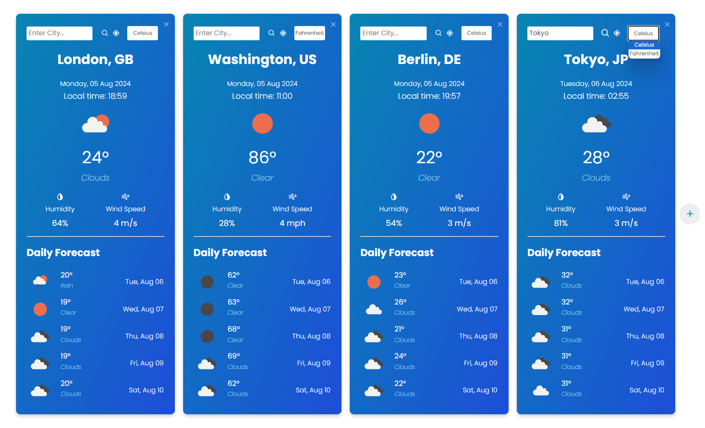

# Weather Comparison App

React app for comparing current weather and forecasts in multiple cities



## Features

- Display current weather and 5-day forecast for multiple cities
- Add and remove weather cards for different cities
- Search for weather by city name or use geolocation for the current location
- Switch between metric (Celsius) and imperial (Fahrenheit) units

## Developer Installation

1. Clone the repository

```
    git clone https://github.com/orszaczkyanna/react-weather-comparison-app.git
    cd react-weather-comparison-app
```

2. Install dependencies

```
    npm install
```

3. Create a `.env` file in the root directory and add your OpenWeatherMap API key

```
    VITE_API_KEY=YOUR_API_KEY
```

4. Start the development server

```
    npm run dev
```

## Credits

- Inspired by the tutorial [Build A Weather App With React JS](https://www.youtube.com/watch?v=SAE_TN2mD3Q)
- Weather data sourced from [OpenWeatherMap](https://openweathermap.org/)
- [Favicon](https://www.iconfinder.com/icons/3553109/cloud_cloudy_forecast_snow_snowy_weather_icon) found on [Iconfinder](https://www.iconfinder.com/)
- Other icons are provided by [React Icons](https://react-icons.github.io/react-icons/)
- Developed with the help of [ChatGPT](https://chatgpt.com/)
